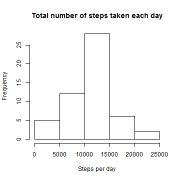
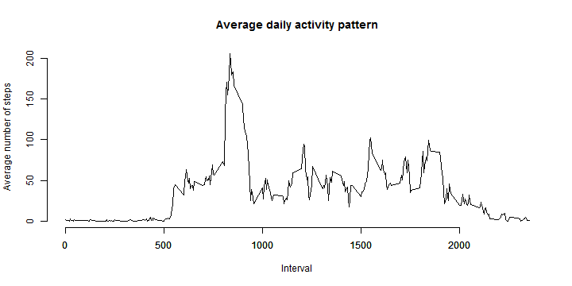
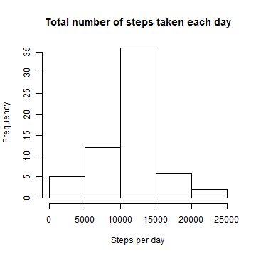
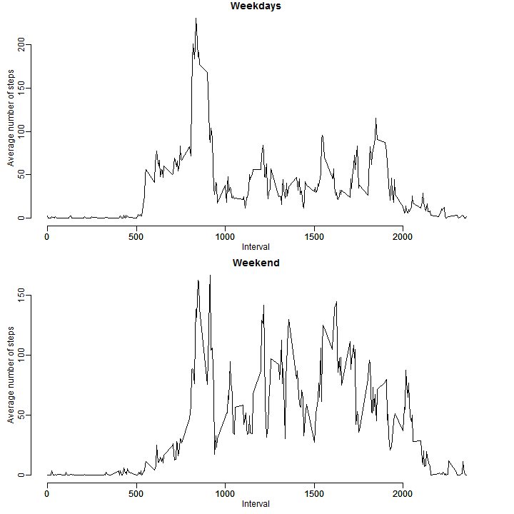

'Reproducible Research'
=================
Peer Assessment No. 1
-----------------


```r
opts_chunk$set(echo = TRUE)
```


### Read data

```r
file <- "D:\\KF_Programmieren\\R\\Coursera_Reproducible_research\\activity.csv"
dataOrig <- read.csv(file = file, header = TRUE)
data <- dataOrig
```


### What is the mean total number of steps taken per day?


```r
stepsDate <- aggregate(steps ~ date, data, FUN = sum)
hist(stepsDate$steps, xlab = "Steps per day", main = "Total number of steps taken each day")
```

 

```r
stepsMean <- as.integer(mean(stepsDate$steps))
stepsMedian <- as.integer(median(stepsDate$steps))
```


Mean total number of steps taken per day: 10766 

Median of the total number of steps taken per day: 10765 

### What is the average daily activity pattern?


```r
stepsInterval <- aggregate(steps ~ interval, data, FUN = mean)
plot(stepsInterval$interval, stepsInterval$steps, type = "l", main = "Average daily activity pattern", 
    xlab = "Interval", ylab = "Average number of steps", bty = "n")
axis(1)
```

 

```r
intervalMax <- stepsInterval$interval[stepsInterval$steps == max(stepsInterval$steps)]
```

Interval 835 contains the maximum number of steps.

### Imputing missing values


```r
numberNA <- length(data[complete.cases(data) == FALSE, 1])
```


The number of missing values is 2304.


```r
dataFill <- dataOrig
completeCases <- complete.cases(dataFill)
for (i in 1:length(dataFill[, 1])) {
    if (completeCases[i] == FALSE) {
        dataFill$steps[i] <- stepsInterval$steps[stepsInterval$interval == dataFill$interval[i]]
    }
}
```


```r
stepsDateFill <- aggregate(steps ~ date, dataFill, FUN = sum)
hist(stepsDateFill$steps, xlab = "Steps per day", main = "Total number of steps taken each day")
```

 

```r
stepsMeanFill <- as.integer(mean(stepsDateFill$steps))
stepsMedianFill <- as.integer(median(stepsDateFill$steps))
```


Mean total number of steps taken per day: 10766 

Median of the total number of steps taken per day: 10766

==> The mean and median total number of steps taken per day changed only slightly
as the missing values were apparently evenly distributed filled with average steps 
per interval. Due to the filling with average values, the mean class of the 
histogramm became larger.

### Are there differences in activity patterns between weekdays and weekends?


```r
weekday <- weekdays(as.Date(dataFill$date))
wd <- c("Montag", "Dienstag", "Mittwoch", "Donnerstag", "Freitag")
we <- c("Samstag", "Sonntag")
for (w in wd) {
    weekday[weekday == w] <- "weekday"
}
for (w in we) {
    weekday[weekday == w] <- "weekend"
}
dataFill$weekday <- factor(weekday)

stepsIntervalWD <- aggregate(steps ~ interval, dataFill[dataFill$weekday == 
    "weekday", ], FUN = mean)
stepsIntervalWE <- aggregate(steps ~ interval, dataFill[dataFill$weekday == 
    "weekend", ], FUN = mean)
par(mfrow = c(2, 1), mar = c(3, 3, 1, 3), mgp = c(1.5, 0.5, 0))
plot(stepsIntervalWD$interval, stepsIntervalWD$steps, type = "l", main = "Weekdays", 
    xlab = "Interval", ylab = "Average number of steps", bty = "n")
axis(1)
plot(stepsIntervalWE$interval, stepsIntervalWE$steps, type = "l", main = "Weekend", 
    xlab = "Interval", ylab = "Average number of steps", bty = "n")
axis(1)
```

 


==> Activity on the weekend is more evenly distributed.
